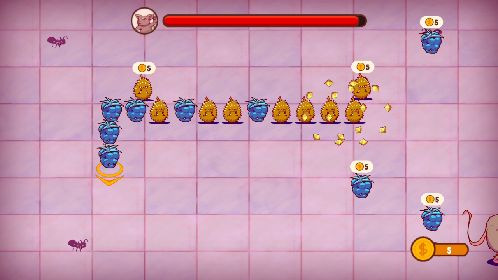

# Super Food Chain

## Overview

Embark on a thrilling adventure in Super Food Chain where you guide a spirited group of fruit companions through a perilous kitchen teeming with culinary foes.
Assemble a dynamic chain of allies - each with unique abilities to aid you in outmaneuvering relentless enemis and conquering formidable bosses. In this delectable fusion
of action and strategy, every swift decision brings you closer to kitchen domination.

## Instructions

- Use the arrow keys for movement - you cannot move backwards.
- Shoot minions (bugs) to produce coins. Move over coins to collect them.
- Use coins to purchase companions. Move over companions to collect them.
- Win a level by defeating its boss.

## Preview

## Installation

Install the most recent version from the latest release, which can be located on the right sidebar of this repository.

## LibGDX
A [libGDX](https://libgdx.com/) project generated with [gdx-liftoff](https://github.com/libgdx/gdx-liftoff).

This project was generated with a template including simple application launchers and an `ApplicationAdapter` extension that draws libGDX logo.

### Platforms

- `core`: Main module with the application logic shared by all platforms.
- `lwjgl3`: Primary desktop platform using LWJGL3; was called 'desktop' in older docs.

### Gradle

This project uses [Gradle](https://gradle.org/) to manage dependencies.
The Gradle wrapper was included, so you can run Gradle tasks using `gradlew.bat` or `./gradlew` commands.
Useful Gradle tasks and flags:

- `--continue`: when using this flag, errors will not stop the tasks from running.
- `--daemon`: thanks to this flag, Gradle daemon will be used to run chosen tasks.
- `--offline`: when using this flag, cached dependency archives will be used.
- `--refresh-dependencies`: this flag forces validation of all dependencies. Useful for snapshot versions.
- `build`: builds sources and archives of every project.
- `cleanEclipse`: removes Eclipse project data.
- `cleanIdea`: removes IntelliJ project data.
- `clean`: removes `build` folders, which store compiled classes and built archives.
- `eclipse`: generates Eclipse project data.
- `idea`: generates IntelliJ project data.
- `lwjgl3:jar`: builds application's runnable jar, which can be found at `lwjgl3/build/libs`.
- `lwjgl3:run`: starts the application.
- `test`: runs unit tests (if any).

Note that most tasks that are not specific to a single project can be run with `name:` prefix, where the `name` should be replaced with the ID of a specific project.
For example, `core:clean` removes `build` folder only from the `core` project.
